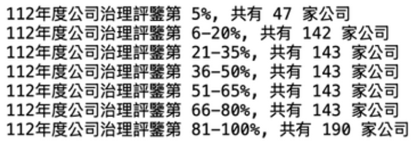
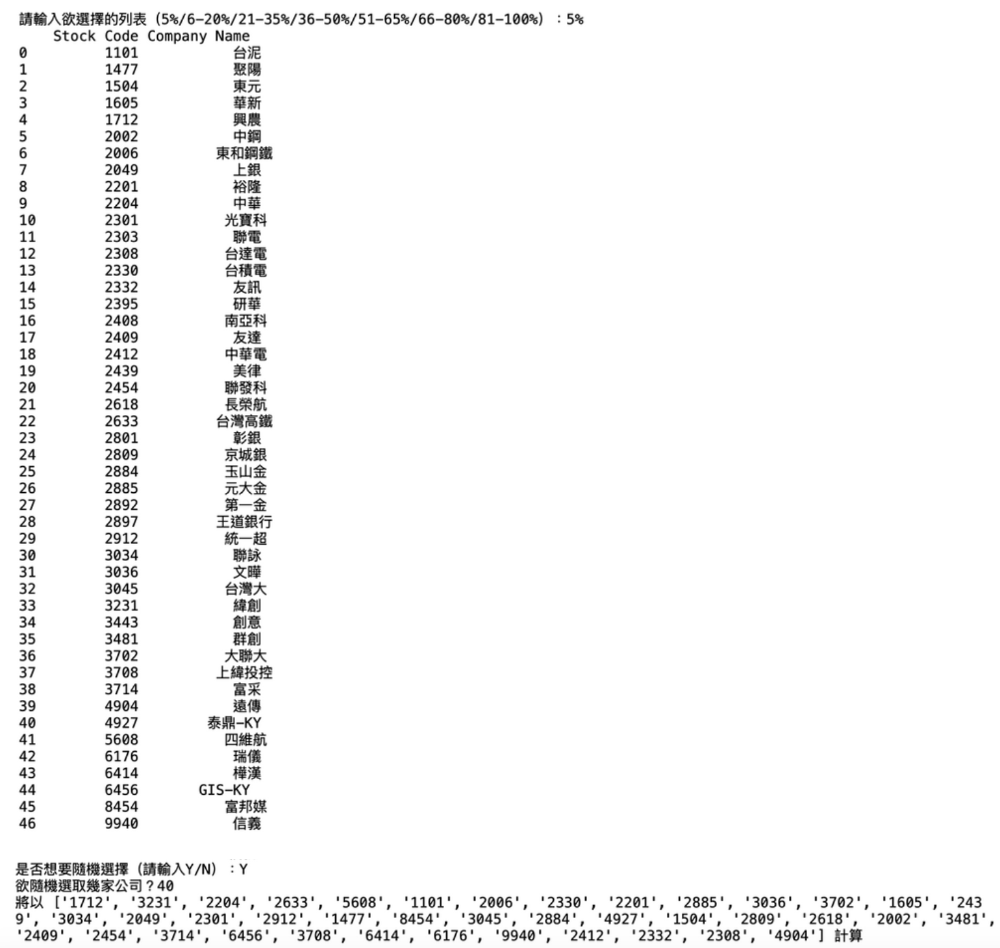
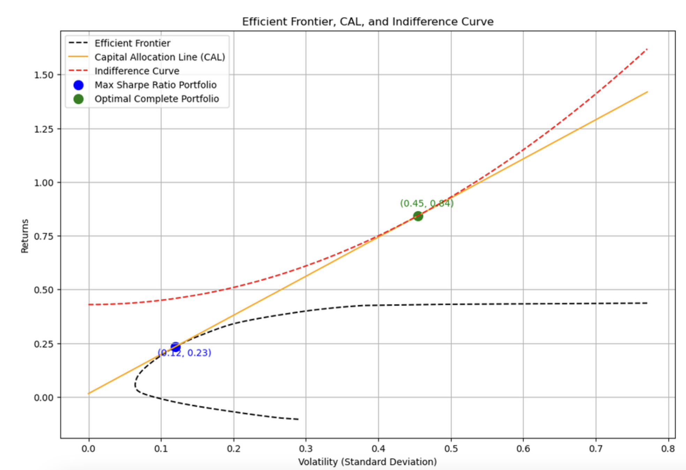
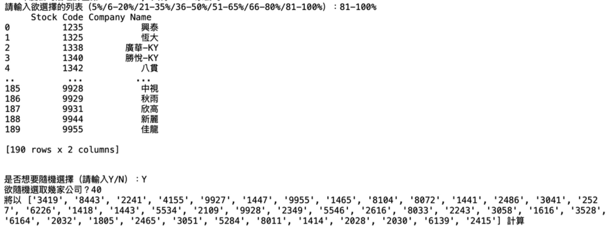
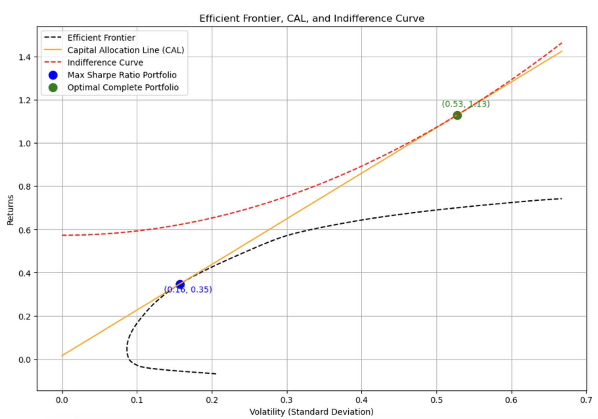

# Relationship-Between-Corporate-ESG-Performance-and-Profitability
# Introduction<br>

As global extreme weather events become more frequent and political situations remain unstable, companies are facing unprecedented operational challenges, with supply chain disruption risks increasingly growing. To address these challenges, more and more countries are responding to ESG (Environmental, Social, and Governance) issues and establishing related regulations. For instance, the European Union's Carbon Border Adjustment Mechanism (CBAM) will officially begin levying carbon tariffs on January 1, 2026; Taiwan requires listed and over-the-counter companies to prepare sustainability reports and declare carbon fees starting in 2025. Under such trends, corporate sustainability performance is no longer just a future vision but a critical factor directly impacting operational performance.

Moreover, sustainable investing has become a significant trend in capital markets. ETFs using sustainability as a stock selection indicator are showing notable performance. According to Bloomberg data, from October 2013 onwards, the "Emerging Markets Sustainable" and "Asia-Pacific Sustainable" indices have recorded approximately 13.54% and 4.62% excess returns, respectively, compared to the "Emerging Markets Stock" and "Asia-Pacific Stock" indices.

As sustainability issues increasingly gain attention, the correlation between corporate sustainability performance and stock price performance is gradually drawing focus. Many investors have incorporated ESG scores into their stock selection criteria, believing these can influence investment returns. Therefore, this report will explore whether corporate sustainability performance truly impacts company stock prices.

# Relative Research

According to research by Lasse Heje Pedersen, a professor at Copenhagen Business School, in his work 'Responsible Investing: The ESG-Efficient Frontier', the study explores the impact of ESG ratings on investors' efficiency frontier. The research methodology involves monthly sorting stocks into five quintile portfolios based on ESG scores, and processing them using equally-weighted (Panel A) and market capitalization-weighted (Panel B) approaches. The portfolios were then subjected to three-factor, five-factor, and six-factor models to analyze return differences between high and low ESG score portfolios.

The research results indicate that high ESG score portfolios may generate positive abnormal returns in most cases, but the final outcomes are influenced by weighting methods and the selection of control factors. Therefore, market participants should remain cautious when interpreting the impact of ESG scores on returns and consider the interactions between ESG scores and other risk factors.

After evaluation, we believe that risk factors are difficult to fully control, and different market factors may impact the results. To simplify the analysis and avoid overfitting, this report will randomly select 40 companies from the first and last-ranked intervals. This approach effectively focuses on companies with extreme ESG performance and provides a clearer comparison of results.

# Methodology

__Optimization and Risk-Return Analysis of Stock Portfolios Based on Corporate Governance Ratings__<br>

Designed for stock portfolio analysis, the specific purpose is to help investors select the most suitable investment portfolio based on the returns and risks of different stocks. The program covers stock data retrieval, statistical calculations, portfolio optimization, and visualization of the efficient frontier and capital allocation line. Below is a detailed analysis of each component:

__1. Download and import packages:__

__・openpyxl:__ Used for handling Excel files. In this program, this library is used to read and process the list of companies and related stock codes stored in Excel.<br>
__・random:__ Used for randomly selecting companies. During the analysis process, this might involve randomly choosing a certain number of companies for analysis.<br>
__・pandas:__ Used for data processing. This library is utilized to handle stock data in DataFrame format, conduct various statistical operations, and perform data cleaning.<br>
__・numpy:__ Provides mathematical computation functions, primarily used for matrix operations such as the weighted sum of mean returns and the calculation of covariance matrices.<br>
__・yfinance__: This library is used for fetching stock data from Yahoo Finance, capable of automatically downloading historical price data for specified stocks.<br>
__・matplotlib.pyplot:__ Used for generating charts. In the program, this library is used to plot the efficient frontier, capital allocation line, and indifference curve.<br>
__・scipy.optimize.minimize:__ This tool is used for solving optimization problems. In this code, this function is used to calculate the portfolio with the maximum Sharpe ratio.<br>

```python
import openpyxl 
import random 
import pandas as pd
import numpy as np
import yfinance as yf
import matplotlib.pyplot as plt
from scipy.optimize import minimize
```

__2. Parameter Setting and Initialization:__

__・figsize:__ Used to set the size of the figures.<br>
__・rf:__ This is the risk-free rate, based on Taiwan's 10-year government bond yield of 1.53% (0.0153) as of December 3, 2024.<br>
__・num_points:__ Defines the number of points within the portfolio return range when calculating the efficient frontier.<br>

```python
figsize = (12, 8)
rf = 0.0153 
num_points = 100
```

__3. Fetching Stock Data:__

__・Purpose:__ This code fetches historical data for specified stock tickers from Yahoo Finance. It first retrieves the historical data using the yf.Ticker(ticker).history() function and then converts the data to monthly returns (over the past 60 months). If the data is incomplete or unavailable, the stock is skipped.<br>
__・Fetching Historical Data:__ Use yf.Ticker(ticker).history(period='max') to retrieve all historical data for each stock.<br>
__・Processing Date Format:__ Ensure the time index in the retrieved data is DatetimeIndex and remove its timezone information.<br>
__・Calculating Monthly Returns:__ Use resample("M").last().pct_change().iloc[-61:-1] to calculate the monthly returns for each stock over the past 60 months (annual returns are based on monthly returns multiplied by 12).<br>
__・Filtering Valid Data:__ Skip stocks if their data is invalid or missing.<br>
__・Combining All Stock Data:__ Finally, merge the return data of all stocks into one DataFrame and return the list of valid stock tickers.<br>

```python
def get_stock_data(symbols):
    data = []
    valid_symbols = []
    for ticker in symbols:
        try:
            history = yf.Ticker(ticker).history(period='max')
            if not isinstance(history.index, pd.DatetimeIndex):
                history.index = pd.to_datetime(history.index)
            history.index = history.index.tz_localize(None)  # Remove timezone
            monthly = history.resample("M").last().pct_change().iloc[-61:-1]
            if monthly.empty:
                continue
            monthly["Name"] = ticker
            data.append(monthly[["Close", "Name"]])
            valid_symbols.append(ticker)
        except Exception as e:
            print(f"Warning: Could not retrieve data for {ticker}. Error: {e}")
    if not valid_symbols:
        raise ValueError("No valid symbols to process.")
    merged = pd.concat(data)
    return merged, valid_symbols
```

__4. Calculating the Mean Return and Covariance Matrix of Stocks:__

In this function, we convert the monthly return data of each stock into a DataFrame format and then calculate the annualized return (multiplied by 12) and the annualized covariance matrix for each stock.

__・pivot(columns="Name", values="Close")__ transforms each stock's data into separate columns for each stock.<br>
__・mean()__ calculates the average monthly return for each stock and then annualizes it.<br>
__・cov()__ computes the covariance matrix of the stock returns and annualizes it.<br>

```python
def calc_stats(df):
    numeric_data = df.pivot(columns="Name", values="Close")
    mean = numeric_data.mean() * 12  # Annualized mean returns
    cov = numeric_data.cov() * 12  # Annualized covariance matrix
    return mean, cov
```

__5. Calculating the Maximum Sharpe Ratio Portfolio:__

The purpose of this function is to calculate the portfolio with the maximum Sharpe ratio. The Sharpe ratio measures the return per unit of risk, and the formula is:

__Sharpe Ratio = (Return − Risk Free Rate) / Volatility__

The goal of this portfolio is to find the optimal weights by minimizing the negative Sharpe ratio. The minimize function is used for optimization, and the SLSQP method is applied for constrained optimization.

```python
def calc_max_sharpe(mean, cov):
    def neg_sharpe(weights, mean, cov, rf):
        ret = np.dot(weights, mean)
        vol = np.sqrt(np.dot(weights.T, np.dot(cov, weights)))
        return -(ret - rf) / vol

    constraints = ({"type": "eq", "fun": lambda w: np.sum(w) - 1},)
    bounds = [(0, 1) for _ in range(len(mean))]
    result = minimize(
        neg_sharpe,
        x0=np.ones(len(mean)) / len(mean),
        args=(mean, cov, rf),
        method="SLSQP",
        bounds=bounds,
        constraints=constraints
    )
    weights = result.x
    ret = np.dot(weights, mean)
    vol = np.sqrt(np.dot(weights.T, np.dot(cov, weights)))
    sharpe_ratio = (ret - rf) / vol
    return {"Returns": ret, "Volatility": vol, "Weights": weights, "Sharpe Ratio": sharpe_ratio}
```

__6. Calculating the Efficient Frontier:__

This function calculates the efficient frontier of a portfolio, which is a curve that shows the minimum risk (volatility) for a given return rate. This is an important concept in Capital Market Theory. For each target return rate, the function optimizes the portfolio weights to minimize risk.

__・Define Volatility Calculation Function:__ Use the portfolio_volatility function to calculate the portfolio's volatility (i.e., risk).<br>
__・Optimization Process:__ For each target return rate (from the minimum return rate to the maximum return rate), calculate the corresponding optimal portfolio weights and their volatility.<br>
__・Return the Efficient Frontier:__ Finally, return a DataFrame that includes the volatility and returns for different target return rates.<br>

```python
def calc_efficient_frontier(mean, cov, num_points):
    def portfolio_volatility(weights, mean, cov):
        return np.sqrt(np.dot(weights.T, np.dot(cov, weights)))

    results = []
    for target_return in np.linspace(mean.min(), mean.max(), num_points):
        constraints = (
            {"type": "eq", "fun": lambda w: np.sum(w) - 1},
            {"type": "eq", "fun": lambda w: np.dot(w, mean) - target_return}
        )
        bounds = [(0, 1) for _ in range(len(mean))]
        weights = minimize(
            portfolio_volatility,
            x0=np.ones(len(mean)) / len(mean),
            args=(mean, cov),
            method="SLSQP",
            bounds=bounds,
            constraints=constraints
        )
        vol = portfolio_volatility(weights.x, mean, cov)
        results.append({"Returns": target_return, "Volatility": vol})
    return pd.DataFrame(results)
```

__7. Plotting the Efficient Frontier, Capital Allocation Line, and Indifference Curves:__

This code defines a plot_efficient_frontier_cal function, used to plot the Efficient Frontier, Capital Allocation Line (CAL), and Indifference Curves. These elements help demonstrate the optimal portfolio selection based on different risk preferences in portfolio optimization.

__・Calculating the Efficient Frontier:__ Use the calc_efficient_frontier function to calculate the optimal returns and standard deviations (volatility) at different risk levels, and plot the efficient frontier with a black dashed line.<br>
__・Plotting the Capital Allocation Line (CAL):__ The CAL shows the relationship between expected return and risk (volatility) when an investor allocates funds between a risk-free asset (such as treasury bills) and high-risk assets. The slope of the CAL represents the maximum Sharpe ratio, indicating the best risk-adjusted return.<br>
__・Plotting the Indifference Curves:__ Indifference curves display combinations of returns and risks where the investor's attitude towards risk remains consistent on each curve. The risk aversion coefficient A is used to control the intensity of risk preference.<br>
__・Marking the Maximum Sharpe Ratio Portfolio:__ The maximum Sharpe ratio portfolio is the one that achieves the highest return for a given level of risk. This point is marked in blue on the chart, showing its volatility and return.<br>
__・Calculating and Marking the Optimal Complete Portfolio:__ Based on the risk aversion coefficient, calculate the optimal complete portfolio (a mix of risk-free assets and the maximum Sharpe ratio portfolio) and mark it in green on the chart.<br>
__・Graph Settings:__ Set the chart title, X-axis (volatility), and Y-axis (returns), and display the legend and grid lines.<br>

The purpose of this function is to help investors visualize the relationship between risk and return and select the most suitable portfolio based on different risk preferences.

```python
def plot_efficient_frontier_cal(mean, cov, max_sharpe_port):
    eff_frontier = calc_efficient_frontier(mean, cov, num_points)

    plt.figure(figsize=figsize)

    # Efficient Frontier
    plt.plot(eff_frontier["Volatility"], eff_frontier["Returns"], "k--", label="Efficient Frontier")

    # Capital Allocation Line (CAL)
    cal_x = np.linspace(0, max(eff_frontier["Volatility"]), 100)
    cal_y = rf + (max_sharpe_port["Sharpe Ratio"]) * cal_x
    plt.plot(cal_x, cal_y, "orange", label="Capital Allocation Line (CAL)")

    # Indifference Curve
    A = 4  # Risk aversion coefficient
    optimal_y = (max_sharpe_port["Returns"] - rf) / (A * max_sharpe_port["Volatility"]**2)
    optimal_u = rf + optimal_y * (max_sharpe_port["Returns"] - rf) - 0.5 * A * optimal_y**2 * max_sharpe_port["Volatility"]**2
    indifference_sigma = np.linspace(0, max(cal_x), 100)
    indifference_return = optimal_u + 0.5 * A * np.square(indifference_sigma)
    plt.plot(indifference_sigma, indifference_return, "r--", label="Indifference Curve")

    # Mark the Maximum Sharpe Ratio Portfolio
    plt.scatter(max_sharpe_port["Volatility"], max_sharpe_port["Returns"], color="b", s=100, label="Max Sharpe Ratio Portfolio")
    plt.annotate(
        f"({max_sharpe_port['Volatility']:.2f}, {max_sharpe_port['Returns']:.2f})",
        (max_sharpe_port["Volatility"], max_sharpe_port["Returns"]),
        textcoords="offset points", xytext=(10, -10), ha="center", color="blue"
    )
    
    # Calculating the Complete Portfolio Return and Volatility
    complete_return_good = rf + optimal_y * (max_sharpe_port["Returns"] - rf)
    complete_std_good = (complete_return_good - rf) / max_sharpe_port["Sharpe Ratio"]
    plt.scatter(complete_std_good, complete_return_good, color="g", s=100, label="Optimal Complete Portfolio")
    plt.annotate(
        f"({complete_std_good:.2f}, {complete_return_good:.2f})",
        (complete_std_good, complete_return_good),
        textcoords="offset points", xytext=(10, 10), ha="center", color="green"
    )

    # Plot details
    plt.title("Efficient Frontier, CAL, and Indifference Curve")
    plt.xlabel("Volatility (Standard Deviation)")
    plt.ylabel("Returns")
    plt.legend()
    plt.grid(True)
    plt.show()
```

__8. Reading and Processing Excel Data__

The main function of this code is to read the company data from the company_list.xlsx file, randomly select companies or manually select companies based on user-chosen conditions, and calculate and plot the efficient frontier, capital allocation line (CAL), and indifference curve for the maximum Sharpe ratio portfolio based on the stock price data of these companies.

__Steps of the Code:__

__・Read the Excel File and Display Company Data:__<br>
a) Use the openpyxl library to load the Excel file company_list.xlsx.<br>
b) Iterate through the sheet names and list the number of companies in each sheet, displaying messages like "112年度公司治理評鑒第 {sheet.title}, 共有 {sheet.max_row} 家公司" (112 Annual Corporate Governance Evaluation, Sheet {sheet.title}, containing {sheet.max_row} companies).

__・User Selection of Company List:__<br>
a) Users need to select a company list (e.g., 5%, 6-20%, etc.), corresponding to the sheet names.<br>
b) If the user-entered sheet name exists in the workbook, the data from that sheet is converted into a DataFrame and displayed.

__・Random or Manual Company Selection:__<br>
a) Users can choose whether to randomly select companies.<br>
b) If random selection is chosen, a specified number (num) of companies are randomly selected from the chosen company codes for analysis.<br>
c) If manual selection is chosen, the company codes are provided by the user, separated by /, and only companies from the list are selected.

__・Fetch Stock Data:__<br>
a) The selected company codes are appended with the .tw suffix to form stock codes suitable for the Taiwan Stock Exchange.<br>
b) The get_stock_data function is called, which should fetch the historical data of these stocks from a source such as Yahoo Finance or other APIs.

__・Calculate Stock Data Statistics:__<br>
a) Use the calc_stats function to calculate the mean return (mean) and covariance matrix (cov) of the stocks.

__・Calculate and Plot Maximum Sharpe Ratio Portfolio:__<br>
a) Use the calc_max_sharpe function to calculate the statistics of the maximum Sharpe ratio portfolio.<br>
b) Use the plot_efficient_frontier_cal function to plot the efficient frontier, capital allocation line, and indifference curves, and mark the maximum Sharpe ratio portfolio.<br>


```python
def get_values(sheet):
    return [[cell.value for cell in row] for row in sheet]

# Main Program
wb = openpyxl.load_workbook('company_list.xlsx')
names = wb.sheetnames

for name in names:
    sheet = wb[name]
    print(f'112年度公司治理評鑒第 {sheet.title}, 共有 {sheet.max_row} 家公司')

choose_sheet = input("請輸入欲選擇的列表（5%/6-20%/21-35%/36-50%/51-65%/66-80%/81-100%）：")
if choose_sheet in names:
    code_lst = get_values(wb[choose_sheet])
    codes = [str(row[0]) for row in code_lst]
    code_df = pd.DataFrame(code_lst, columns=["Stock Code", "Company Name"])
    print(code_df)

    ran = input("是否想要隨機選擇（請輸入Y/N）：")
    if ran == "Y":
        random.shuffle(codes)
        num = int(input("欲隨機選取幾家公司？"))
        company_lst = codes[:num]
        print(f'將以 {company_lst} 計算')
    elif ran == "N":
        com = input("請輸入欲查詢的公司代碼並以 / 隔開（例：1101/1102/1103）：")
        company_lst = [c for c in com.split("/") if c in codes]
        print(f'將以 {company_lst} 計算')
    else:
        print("請重新輸入")
else:
    print("請輸入正確列表")

symbols = [c + '.tw' for c in company_lst]

# Fetch data and calculate statistics
merge_stock, valid_symbols = get_stock_data(symbols)
mean, cov = calc_stats(merge_stock)

# Find and plot the Maximum Sharpe Ratio portfolio
max_sharpe_port = calc_max_sharpe(mean, cov)
plot_efficient_frontier_cal(mean, cov, max_sharpe_port)
```
__9. Demo Example:__

Randomly select 40 companies from the top 5% and the bottom 80% of the Corporate Governance Evaluation lists as examples.
__・Display the number of companies in each list:__


__・Select 40 random companies from the top 5%:__


__Result: Sharpe Ratio = 1.79__


__・Select 40 random companies from the bottom 81-100%:__


__Result: Sharpe Ratio = 2.09__


# Research Findings

According to the comparison of the two charts in the study, the slope of the Capital Allocation Line (CAL) for high ESG performance companies, i.e., the Sharpe ratio, is 1.79, which is lower than the 2.09 of low ESG performance companies. This indicates a lower risk-adjusted return capability. Therefore, it can be concluded that high ESG performance companies' portfolios do not offer higher returns at the same risk level, and their capital efficiency is lower compared to low ESG performance companies.

Additionally, the comparison of the efficient frontier curves shows that the efficient frontier for high ESG performance companies is closer to the lower right corner, indicating that these companies cannot achieve higher returns at the same risk level, resulting in lower capital efficiency compared to low ESG performance companies. Conversely, the efficient frontier curve for low ESG performance companies leans towards the upper left, indicating that these companies can offer relatively higher returns at lower risk levels, demonstrating stronger risk-adjusted return capabilities and higher efficiency.

Moreover, the difference in the intersection points between the indifference curves and CAL also provides evidence. In the chart for low ESG performance companies, the intersection point is located in the upper-middle part of the efficient frontier, indicating that these companies' portfolios can maximize utility while taking on appropriate risks. In contrast, the intersection point for high ESG performance companies leans towards the lower right part of the efficient frontier, indicating a lack of attractiveness to investors in balancing risk and return.

In summary, the research results show that high ESG performance companies have disadvantages in efficient frontier position, CAL slope, and indifference curve intersection points, indicating that their portfolios have lower capital efficiency compared to low ESG performance companies. This finding challenges the assumption that corporate sustainability performance is necessarily positively correlated with market value, providing important implications for future research.

# Research Discussion/Conclusion

__Research Significance__

This study shows that a company's ESG performance has a certain impact on its stock price and investment returns. However, the results indicate that the efficient frontier position for high ESG performance companies is closer to the lower right corner, and the slope of the Capital Allocation Line (CAL) is lower than that of low ESG performance companies, showing weaker risk-adjusted return capabilities and relatively lower capital efficiency. This means that high ESG performance companies cannot provide higher returns at the same risk level, challenging the common assumption that sustainable performance is necessarily positively correlated with market value. Nevertheless, these results provide important references for investors considering ESG factors in their investment decisions and remind corporate managers to balance sustainability and financial efficiency in promoting sustainable development. The results of this study offer new insights into future investment strategies and resource allocation, emphasizing that the impact of ESG factors should be interpreted cautiously in specific contexts.

__Research Limitations__

The main limitations of this study lie in the applicability of the sample range and analysis methods. First, the study focuses only on companies with extreme ESG performance (combinations of high and low ESG scores), not considering mid-range ESG performance companies, which may limit the interpretation of overall market behavior. Second, the study's subjects are concentrated on companies in specific regions (e.g., Taiwan), without fully considering the heterogeneity in policies, cultures, and economic environments in other regions, which may affect the results. Additionally, this study mainly uses static analysis methods and does not capture the dynamic impact of ESG performance changes on stock prices and returns over time, potentially underestimating the long-term value potential of ESG.

__Future Research Directions__

Future research should expand the sample range to include companies with mid-range ESG performance to more comprehensively reflect market diversity. Additionally, it is recommended to further study the impact of ESG performance on financial performance in different regions and industries, especially the performance differences when facing policy changes or environmental challenges. To understand the long-term impact of ESG on corporate value, dynamic analysis methods, such as longitudinal data analysis or time series models, should be used to deeply understand how ESG performance accumulates and affects stock prices and returns over time. Through these efforts, future research will better explain the complex relationship between ESG and market value, providing a more solid theoretical foundation and practical recommendations for policymakers, investors, and corporate managers.

# References

Pedersen, L. H., Fitzgibbons, S., & Pomorski, L. (2021). Responsible investing: The ESG-efficient frontier. Journal of Financial Economics, 142(2), 572-597. https://doi.org/10.1016/j.jfineco.2020.11.001<br>
Wu, M. H. (2021). Manager Today (Digital) - 1 Issue, No.202_Sep-21. 
